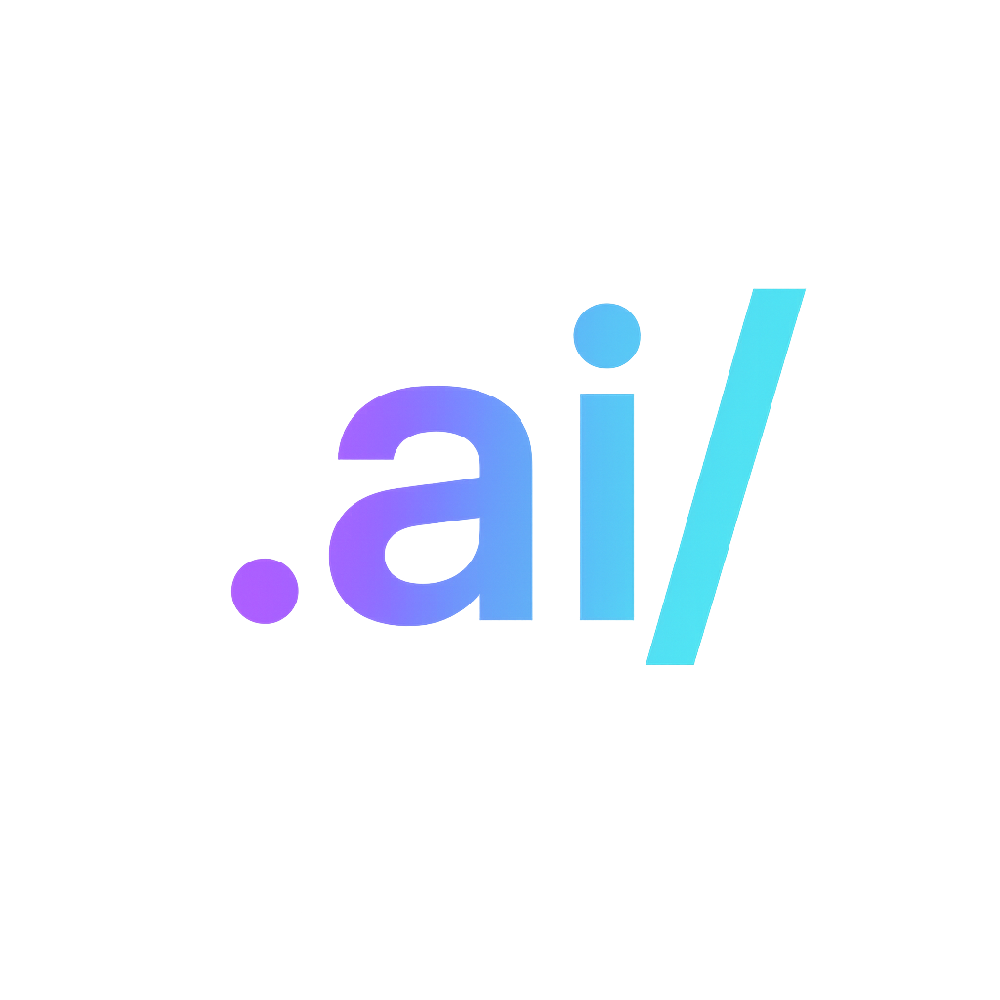

<div align="center">



# ✅ VERSA Conformance Suite

### Black-box tests for VERSA-compatible runtimes

[](LICENSE)
[](./scenarios)
[](https://github.com/dotAIslash/dotaislash-conformance/discussions)

[**Run Tests**](#-running-tests) · [**VERSA Spec**](https://github.com/dotAIslash/dotaislash-spec) · [**Certify Your Tool**](#-certification)

</div>

---

## 🎯 What is this?

A **comprehensive test suite** that verifies whether a tool correctly implements the VERSA specification. Think of it as the "acid test" for VERSA compliance.

### Why Conformance Testing?

- ✅ **Verify Implementations** - Prove your tool supports VERSA
- 🐛 **Catch Bugs Early** - Find spec violations before users do
- 📊 **Measure Coverage** - Track which features are supported
- 🏆 **Earn Certification** - Display the "VERSA Compatible" badge

---

## 🧪 Test Scenarios

### Core Scenarios

| Category | Scenarios | Purpose |
|----------|-----------|---------|
| **Parsing** | 12 tests | Validate JSON/Markdown parsing |
| **Merging** | 15 tests | Profile merge strategies |
| **Validation** | 10 tests | Schema compliance |
| **Context** | 8 tests | Context assembly |
| **Permissions** | 5 tests | Security enforcement |

### Scenario Structure

```
scenarios/
├── core/
│   ├── 001-parse-context.json          # Test definition
│   ├── 001-parse-context.ai/           # Input .ai/ folder
│   └── 001-parse-context.expected.json # Expected output
├── profiles/
│   ├── 010-deep-merge.json
│   ├── 010-deep-merge.ai/
│   └── 010-deep-merge.expected.json
└── edge-cases/
    ├── 050-circular-deps.json
    ├── 050-circular-deps.ai/
    └── 050-circular-deps.expected.json
```

---

## 🚀 Quick Start

### Run Tests Against Your Tool

```bash
# Clone the suite
git clone https://github.com/dotAIslash/dotaislash-conformance.git
cd dotaislash-conformance

# Install dependencies
pnpm install

# Run all tests against your implementation
pnpm test --adapter ./path/to/your-adapter

# Run specific category
pnpm test:core --adapter ./path/to/your-adapter
pnpm test:profiles --adapter ./path/to/your-adapter

# Generate report
pnpm test:report --adapter ./path/to/your-adapter
```

---

## 📋 Test Categories

### 1. **Core Parsing Tests**

Verify basic `.ai/` folder parsing:

- ✅ Parse valid `context.json`
- ✅ Handle missing optional fields
- ✅ Reject invalid JSON
- ✅ Parse Markdown rules with `ai:meta`
- ✅ Handle file references
- ✅ Validate version field

### 2. **Profile Merging Tests**

Test merge strategies:

- ✅ Deep merge objects
- ✅ Shallow merge arrays
- ✅ Replace mode
- ✅ Nested merging
- ✅ Array concatenation
- ✅ Priority handling

### 3. **Validation Tests**

Schema compliance:

- ✅ Required fields present
- ✅ Type checking
- ✅ Format validation
- ✅ Enum constraints
- ✅ Pattern matching
- ✅ Cross-field validation

### 4. **Context Assembly Tests**

Build complete context:

- ✅ Load all rules
- ✅ Resolve file patterns
- ✅ Include agent configs
- ✅ Merge tool definitions
- ✅ Apply permissions
- ✅ Handle circular refs

### 5. **Permission Tests**

Security enforcement:

- ✅ File access controls
- ✅ Network permissions
- ✅ Secret bindings
- ✅ Deny-first policy
- ✅ Ask-before-run

---

## 🔧 Adapter Interface

To test your tool, implement the `ConformanceAdapter` interface:

```typescript
interface ConformanceAdapter {
  // Load and parse .ai/ folder
  loadConfig(path: string): Promise<VersaConfig>;
  
  // Merge profile with base config
  mergeProfile(base: VersaConfig, profile: VersaConfig): Promise<VersaConfig>;
  
  // Assemble complete context
  assembleContext(config: VersaConfig, options: ContextOptions): Promise<Context>;
  
  // Validate configuration
  validate(config: VersaConfig): Promise<ValidationResult>;
}
```

### Example Adapter

```typescript
import { ConformanceAdapter } from '@dotaislash/conformance';

export class MyToolAdapter implements ConformanceAdapter {
  async loadConfig(path: string): Promise<VersaConfig> {
    // Your implementation here
    const context = await fs.readFile(`${path}/context.json`, 'utf-8');
    return JSON.parse(context);
  }

  async mergeProfile(base: VersaConfig, profile: VersaConfig): Promise<VersaConfig> {
    // Your merge logic
    return deepMerge(base, profile);
  }

  async assembleContext(config: VersaConfig, options: ContextOptions): Promise<Context> {
    // Your context assembly
    return {
      rules: await this.loadRules(config.rules),
      settings: config.settings,
      // ...
    };
  }

  async validate(config: VersaConfig): Promise<ValidationResult> {
    // Your validation logic
    return { valid: true, errors: [] };
  }
}
```

---

## 📊 Test Report

After running tests, you get a comprehensive report:

```
╔══════════════════════════════════════════════════════════════════╗
║  VERSA Conformance Test Report                                   ║
╚══════════════════════════════════════════════════════════════════╝

Tool: MyTool v1.0.0
Date: 2025-10-16
Spec Version: VERSA 1.0

━━━━━━━━━━━━━━━━━━━━━━━━━━━━━━━━━━━━━━━━━━━━━━━━━━━━━━━━━━━━━━━━

Overall: 45/50 PASSED (90%)

Category Breakdown:
  ✅ Core Parsing       12/12 (100%)
  ✅ Profile Merging    13/15 (87%)
  ✅ Validation         10/10 (100%)
  ⚠️  Context Assembly   7/8  (88%)
  ✅ Permissions         3/5  (60%)

━━━━━━━━━━━━━━━━━━━━━━━━━━━━━━━━━━━━━━━━━━━━━━━━━━━━━━━━━━━━━━━━

Failed Tests:

  ❌ profiles/014-array-concat
     Expected: Arrays to concatenate
     Got: Arrays replaced

  ❌ context/007-circular-reference
     Expected: Error detected
     Got: Infinite loop

  ❌ permissions/003-secret-binding
     Expected: Secret not exposed
     Got: Secret in plain text

━━━━━━━━━━━━━━━━━━━━━━━━━━━━━━━━━━━━━━━━━━━━━━━━━━━━━━━━━━━━━━━━

Recommendation: Fix failed tests to earn VERSA certification.
```

---

## 🏆 Certification

### Certification Levels

**🥇 Gold - Full Compliance (100%)**
- All tests pass
- Badge: ``
- Listed on official website

**🥈 Silver - High Compliance (90-99%)**
- Most tests pass with minor gaps
- Badge: ``

**🥉 Bronze - Basic Compliance (75-89%)**
- Core features work
- Badge: ``

### Certification Process

1. **Run Tests**
```bash
pnpm test --adapter ./your-adapter
```

2. **Generate Report**
```bash
pnpm test:report --adapter ./your-adapter --output report.json
```

3. **Submit for Review**
```bash
gh issue create --title "Certification Request: MyTool" \
  --body "$(cat report.json)"
```

4. **Receive Badge**
Once approved, add badge to your README:
```markdown

```

---

## 🧰 Test Development

### Adding New Tests

```bash
# 1. Create test scenario
mkdir scenarios/new-category/100-my-test.ai
cd scenarios/new-category/

# 2. Create test definition
cat > 100-my-test.json << EOF
{
  "id": "100",
  "name": "My Test",
  "category": "new-category",
  "description": "Tests something important",
  "severity": "required",
  "input": "100-my-test.ai",
  "expected": "100-my-test.expected.json"
}
EOF

# 3. Create test input (.ai/ folder)
mkdir 100-my-test.ai
echo '{"version":"1.0"}' > 100-my-test.ai/context.json

# 4. Create expected output
cat > 100-my-test.expected.json << EOF
{
  "success": true,
  "config": {"version": "1.0"}
}
EOF

# 5. Run test
pnpm test:single 100
```

---

## 📚 Documentation

- [Test Specification](docs/TEST_SPEC.md)
- [Adapter Guide](docs/ADAPTER_GUIDE.md)
- [Writing Tests](docs/WRITING_TESTS.md)
- [Certification Process](docs/CERTIFICATION.md)

---

## 🤝 Contributing

Help improve VERSA conformance!

### Ways to Contribute

- 🧪 **Add Test Scenarios** - Cover edge cases
- 🐛 **Report Issues** - Found a problem?
- 📝 **Improve Docs** - Help others understand
- 🔧 **Build Adapters** - Test more tools

See [CONTRIBUTING.md](CONTRIBUTING.md) for guidelines.

---

## 📊 Tool Support

| Tool | Status | Pass Rate | Version Tested |
|------|--------|-----------|----------------|
| Cursor | 🟡 In Progress | 85% | - |
| Windsurf | 🔴 Not Tested | - | - |
| Aider | 🔴 Not Tested | - | - |
| Claude | 🔴 Not Tested | - | - |

---

## 📄 License

MIT © [dotAIslash](https://github.com/dotAIslash)

---

<div align="center">

**Ensuring VERSA works the same everywhere**

[Spec](https://github.com/dotAIslash/dotaislash-spec) · [CLI](https://github.com/dotAIslash/dotaislash-cli) · [Schemas](https://github.com/dotAIslash/dotaislash-schemas) · [Examples](https://github.com/dotAIslash/dotaislash-examples)

[⭐ Star us on GitHub](https://github.com/dotAIslash/dotaislash-conformance) · [💬 Discussions](https://github.com/dotAIslash/dotaislash-conformance/discussions)

</div>
